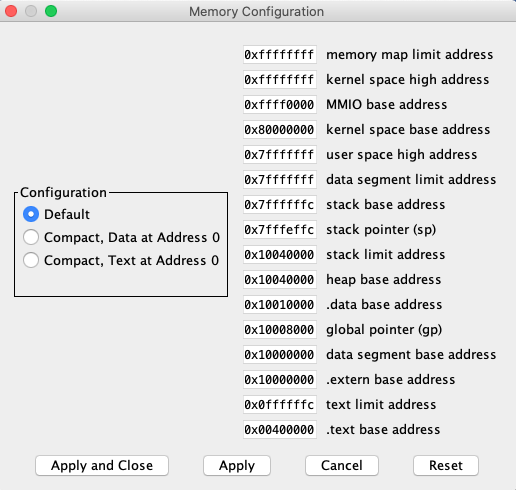

Lecture 9
---

# Virtual Memory

## Lecture

Slides ([PDF](CA_Lecture_09.pdf), [PPTX](CA_Lecture_09.pptx)).

#### Outline

* Virtual memory and physical memory
* Virtual and physical addresses
* Address translation and page table
* Translation lookaside buffer (TLB)

## Workshop


#### Tasks

1. Consider a virtual memory system that can address a total of 2<sup>50</sup> bytes.
   You have unlimited hard drive space, but are limited to 2 GB of semiconductor (physical) memory.
   Assume that virtual and physical pages are each 4 KB in size.
   * How many bits is the physical address?
   * What is the maximum number of virtual pages in the system?
   * How many physical pages are in the system?
   * How many bits are the virtual and physical page numbers?
   * How many page table entries will the page table contain?

__TODO__

#### Examples:

* [PseudoVM.s](https://github.com/andrewt0301/hse-acos-course/blob/master/docs/part1ca/09_VM/PseudoVM.s)

## Homework

1. Programming task "PseudoVM".

Write an exception handler that imitates "virtual memory" for "forbidden" addresses.
A "forbidden" address is any address that causes exceptions
`LOAD_ACCESS_FAULT` and `STORE_ACCESS_FAULT` when we try to access it (read or write).
This is not supported for address `0x0` (it is reserved).



It is suggested to create a table (array) that will store records
`"virtual address":value` (pairs of 4-byte values).
The capacity of the table is 16 records (i.e. `2*4*16=128` bytes).
Address `0x0` can be used to specify an empty record.

"Virtual memory" works only with instructions `lw` and `sw`
that use register `t0` as a source/destination for values
(other registers are not checked).

Reading from an address works in the following way:
* If the address is present in the table, the value stored in the table is returned.
* If the address is missing from the table, `0` is returned.

Writing to an address works in the following way:
* If the address is present in the table, the value stored in the record is updated.
* If the address is missing from the table, but the table has free records,
  a new record `"virtual address":value` is placed into the table.
* If the address is missing from the table and its full (no free records), nothing happens.

Notes:
* Everything is done in the handler (starts with the `handler` label)
  that handles the two exceptions.
* The handler must save and restore all registers it uses (some area in the `.data` section).
* This __[main program](
  https://github.com/andrewt0301/hse-acos-course/blob/master/docs/part1ca/09_VM/PseudoVM.s)__
  will be merged with the handler (you must submit only the handler).
* The main program reads addresses from user input:
  address divisible by `4` are used for reading, others - for writing.  
* Examples of an input and output for the program are below.

Input:
```
21
123
22
1234
20
1001
100500
1000
100
-70001
-70001
-70000
-70004
0
```

Output:
```
1234
100500
0
0
-70001
```

## References

* Virtual Memory. Section 8.4 in [[DDCA]](../../books.md).
* Large and Fast: Exploiting Memory Hierarchy. Chapter 5 in [[CODR]](../../books.md). 
* Ulrich Drepper. [What Every Programmer Should Know About Memory](
  https://github.com/andrewt0301/hse-acos-course/blob/master/related/cpumemory.pdf).
* [Translation lookaside buffer](https://en.wikipedia.org/wiki/Translation_lookaside_buffer) (Wikipedia).
