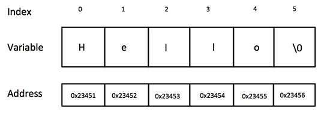

Strings in C
---



__In C, there are no such a data type as string (variable length, locale-aware vs. low-level)__.

#### Conventional LibC string:

* sequence of bytes
* zero-terminated (s. c. ASCIIZ)
* no metadata

### C functions for handling strings

Reference on C function for handling strings and symbols is [here](https://en.cppreference.com/w/c/string/byte).

Main types of functions:

* [Character_classification](https://en.cppreference.com/w/c/string/byte#Character_classification)
* [Conversions_to_numeric_formats](https://en.cppreference.com/w/c/string/byte#Conversions_to_numeric_formats)
* [String_manipulation](https://en.cppreference.com/w/c/string/byte#String_manipulation)
* [String_examination](https://en.cppreference.com/w/c/string/byte#String_examination)
* [Character_array_manipulation](https://en.cppreference.com/w/c/string/byte#Character_array_manipulation)

Most commonly used functions:

* [strlen](https://man7.org/linux/man-pages/man3/strlen.3.html) – calculate the length of a string
* [strcpy](https://man7.org/linux/man-pages/man3/strcpy.3.html) – copy a string
* [strncpy](https://man7.org/linux/man-pages/man3/strncpy.3p.html) - copy `n` symbols of a string
* [strcat](https://man7.org/linux/man-pages/man3/strcat.3.html) – concatenate two strings
* [strdup](https://man7.org/linux/man-pages/man3/strdup.3.html) – duplicate a string
* [strcmp](https://man7.org/linux/man-pages/man3/strcmp.3.html) – compare two strings
* [atoi](https://man7.org/linux/man-pages/man3/atoi.3.html) – convert a string to an integer

The buffer for a string can be a global array, a stack-allocated array or a dynamically
allocated chunk of memory (allocated with the help of
the [malloc](https://man7.org/linux/man-pages/man3/malloc.3.html) function or other functions).
Dynamically allocated strings must be freed with the help
of the [free](https://man7.org/linux/man-pages/man3/free.3p.html) function.

Full list of functions from `<string.h>` is [here](https://man7.org/linux/man-pages/man0/string.h.0p.html).

### Working with command-line arguments

Command-line arguments are passed as strings for the `main` function.
The `argc` argument sspecifies total argument count, the `argv` specifies an array of argument strings.

The program below prints all arguments to the console:
```c
#include <stdio.h>

int main(int argc, char *argv[]) {
    int i;
    for (i = 0; i < argc; i++)
        printf("%s\n", argv[i]);
    return 0;
}
```
Note: 0th argument is the name of the program.

Strings are printed with the help of the [printf](https://man7.org/linux/man-pages/man3/printf.3.html) function.

### Principles of string handling

String handling functions are commonly iterate over the array of characters until `'\0'` (`0`) is encountered.

For example, this program prints all arguments with their lengths calculated by a special function that
imitates the `strlen` library function.

```c
#include <stdio.h>

int mystrlen(const char* str) {
   int len = 0;
   while (*str++) {
      len++;
   }
   return len;
}

int main(int argc, char *argv[]) {
    int i;
    for (i = 0; i < argc; i++) {
        char* arg = argv[i];
        printf("%s (%d)\n", arg, mystrlen(arg));
    }
    return 0;
}
```

### Example

The following program `catargs.c` concatenates all command-line arguments into a single string
and prints this string with the `<` prefix and the `>` suffix:

```bash
acos@acos-vm:~$ ./catargs qwe ASD "1 2 3"
<qweASD1 2 3>
```

```c
#include <stdio.h>
#include <string.h>
#include <stdlib.h>

int main(int argc, char *argv[]) {
    int i;
    int length = 0;
    for(i = 1; i < argc; i++)
        length += strlen(argv[i]);
    char *buf = malloc(length + 3);
    strcpy(buf, "<");
    for(i = 1; i < argc; i++)
        strcat(buf, argv[i]);
    strcat(buf, ">");
    printf("%s\n", buf);
    free(buf);
    return 0;
}
```
