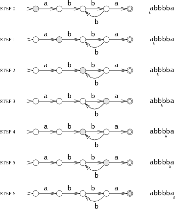

Lecture 5
---

# Strings and regular expressions

## Lecture

Slides ([PDF](OS_Lecture_05.pdf), [PPTX](OS_Lecture_05.pptx)).

#### Theory

* [Strings in C](c_strings.md)
* [Patterns](patterns.md)

### Regular expressions



#### Regular expressions

Narrowest [Chomsky_hierarchy](https://en.wikipedia.org/wiki/Chomsky_hierarchy) formal language class:

* Can be (relatively) easily parsed
* Can describe almost any possible pattern, not bound to context and having no internal parts dependence
  (e. g. «a if precedes by b» or «integer number, than that number of characters» _can not_ be described)
* Laconic

_Warning: To write a regexp is far more easier than to read other's regexp._

1. Atomic regexp:
    * any non-special character matches exactly same character
        * "`E`" → «`E`»
    * a dot "`.`" matches __any__ one character
        * "`.`" → «`E`»
        * "`.`" → «`:`»
        * "`.`" → «`.`»
    * a set of characters matches any character __from the set__:
        * "`[quack!]`" → «`a`»
        * "`[quack!]`" → «`!`»
        * "`[a-z]`" → «`q`» (any small letter)
        * "`[a-z]`" → «`z`» (any small letter)
        * "`[a-fA-F0-9]`" → «`f`» (any hexadecimal digit)
        * "`[a-fA-F0-9]`" → «`D`» (any hexadecimal digit)
        * "`[abcdefABCDEF0-9]`" → «`4`» (any hexadecimal digit)
    * a negative set of characters matches any character __not from the set__:
        * "`[^quack!]`" → «`r`»
        * "`[^quack!]`" → «`#`»
        * "`[^quack!]`" → «`A`»
    * any atomic regexp followed by "`*`" __repeater__ matches a continuous sequence of substrings,
      including empty sequence, each matched by the regexp
        * "`a*`" → «`aaa`»
        * "`a*`" → «``»
        * "`a*`" → «`a`»
        * "`[0-9]*`" → «`7`»
        * "`[0-9]*`" → «``»
        * "`[0-9]*`" → «`1231234`»
        * "`.*`" → _any string_!
    * any complex regexp enclosed by special grouping parenthesis "`\(`" and "`\)`" (see below)
1. Complex regexp
    * A sequence of atomic regexps
    * Matches a continuous sequence of substrings, each matched by corresponded atomic regexp
        * "`boo`" → «`boo`»
        * "`r....e`" → «`riddle`»
        * "`r....e`" → «`r re e`»
        * "`[0-9][0-9]*`" → any non-negative integer
        * "`[A-Za-z_][A-Za-z0-9]*`" → C identifier (alphanumeric sequence with «`_`», not started from digit)
    * grouping parenthesis can be used for repeating complex regexp:
        * "`\([A-Z][a-z]\)*`" → «`ReGeXp`»
        * "`\([A-Z][a-z]\)*`" → «``»
        * "`\([A-Z][a-z]\)*`" → «`Oi`»
    * Implies __leftmost longest rule__ (aka «greedy»):
      In successful match of complex regexp _leftmost_ atomic regexp takes _longest possible_ match,
      second leftmost atomic regexp takes longest match that possible in current condition; and so on
        * "`.*.*`" → all the string leftmost, empty string next
        * "`[a-z]*[0-9]*[a-z0-9]*`" → «`123b0c0`»
            * "`[a-z]*`" → «»
            * "`[0-9]*`" → «`123`»
            * "`[a-z0-9]*`" → «`b0c0`»
        * "`[a-d]*[c-f]*[d-h]*`" → «`abcdefgh`»
            * "`[a-d]*`" → «`abcd`»
            * "`[c-f]*`" → «`ef`»
            * "`[d-h]*`" → «`gh`»
1. Positioning mark
      * "`^regexp`" matches only substrings located at the beginning of the line
      * "`regexp$`" matches only substrings located at the end of line

#### Regexp tools

* [grep](http://man7.org/linux/man-pages/man1/grep.1.html): filtering strings that contain regexp:
  ```bash
  $ cal | grep 18
  16 17 18 19 20 21 22
  $ cal | grep '9.*4'
  9 10 11 12 13 14 15
  ```
* (!) try all examples above via `grep` (happily it colors all substring matches)
* `vim` (command enter command-line mode)
    * `/regexp`: search forward
    * `?regexp`: search backward
* `less` — same
* ...

#### Search and replace

[sed](https://man7.org/linux/man-pages/man1/sed.1.html) — stream editor; if not sure, do not go too deep in.

* search and replace: `s/regexp/replacement`
* e. g.
    * replace once
    ```bash
    $ cal | sed 's/[12][23]/@@/' 
           March 2020     
    Su Mo Tu We Th Fr Sa
     1  2  3  4  5  6  7
     8  9 10 11 @@ 13 14
    15 16 17 18 19 20 21
    @@ 23 24 25 26 27 28
    29 30 31            
    ``` 
    * replace all (___g___lobally)
    ```bash
    $ cal | sed 's/[12][23]/@@/g'
        March 2020     
    Su Mo Tu We Th Fr Sa
     1  2  3  4  5  6  7
     8  9 10 11 @@ @@ 14
    15 16 17 18 19 20 21
    @@ @@ 24 25 26 27 28
    29 30 31
    ```
* Group recall: every substring matched regexp grouped by "`\(`"/"`\)"
  can be inserted into replacement string by referencing to corresponded number ("`\1`", "`\2`" etc):
  ```bash
  $ cal | sed 's/2\([0-6]\)/=\1/g'
       March =0=0     
  Su Mo Tu We Th Fr Sa
   1  2  3  4  5  6  7
   8  9 10 11 12 13 14
  15 16 17 18 19 =0 =1
  =2 =3 =4 =5 =6 27 28
  29 30 31
  $ echo '15 16 17 18 19 20 21' | sed 's/\(15\)\(.*\)\(20\)/\3\2\1/'
  20 16 17 18 19 15 21
  $ echo '==15 16 17 18 19 20 21==' | sed 's/\([0-9][0-9]*\).*\([0-9]\)/\1\2/'
  ==151==
  $ echo '==15 16 17 18 19 20 21==' | sed 's/\([0-9]*\).*\([0-9]\)/\1\2/' 
  1==
  ```
* (!) check [[#complex]] examples with `sed`
* Groups are numbered by the _opening  parenthesis_ order:
  ```bash
  $ echo 'aaabbbccc' | sed 's/\(a*\(b*\)\)/\2-\1=/'
  bbb-aaabbb=ccc
  $ echo '15 16 17 18 19 20 21' | sed 's/\(1.*7.*\(8.*2\)\)/\2-\1=/'
  8 19 20 2-15 16 17 18 19 20 2=1
  ```
* `vim`: same as `sed`, but plus:
    * "`:s/regexp/replacement/`" — replace once in current line
    * "`:s/regexp/replacement/g`" — replace all (globally) in current line
    * "`:%s/regexp/replacement/g`" — replace all in the while file
    * "`:10,30s/regexp/replacement/g`" — replace all in 10, 11, …, 30 line
    * "`:/BEGIN/,/END/s/regexp/replacement/g`" — replace all in lines started from line contains `BEGIN` to the line contains `END`
    * "`:/main(/,/^}/s/'\([^']*\)'/"\1"/g`" — replace all «`'...'`» strings (wich are _not_ in C :) ) to «`"..."`» (which are) in function `main()`
    * "`:/main(/,/^}/s/'\([^']*\)'/"\1"/gc`" — do the same with _confirmation_ of each replacement

## Workshop

#### Outline

* Practice using functions of the C language to handle strings
* Practice using Shell patterns
* Practice using regular expressions

#### Tasks

1. Write a program `catargs.c` that concatenates all command-line arguments
   into a single string and prints this string with the `<` prefix and the `>` suffix:
   ```bash
   acos@acos-vm:~$ ./catargs qwe ASD "1 2 3"
   <qweASD1 2 3>
   ```
__TODO__

## Homework

__TODO__

# References

* Jeffrey Friedl [Mastering Regular Expressions](http://regex.info/book.html) (aka The Owl Book).
* [regex101: build, test, and debug regex](https://regex101.com)
