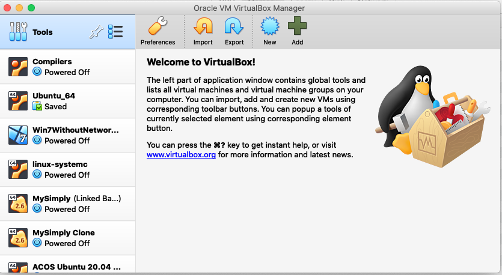
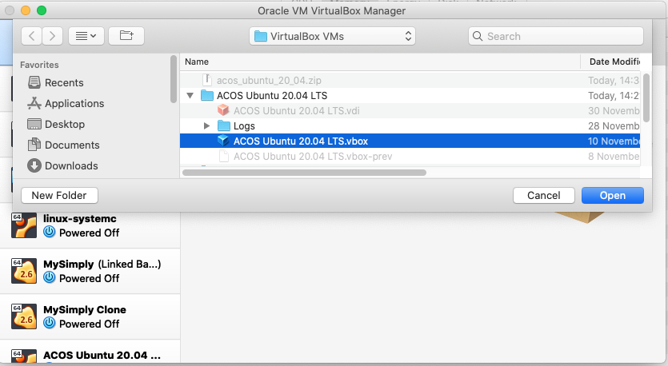

Linux Ubuntu
---

In this course, we will be using [Linux Ubuntu](https://ubuntu.com), which is one the most popular Linux distributions.
A brief description of Linux Ubuntu can be found in [Wikipedia](https://en.wikipedia.org/wiki/Ubuntu).

The Ubuntu version, which we will be working with,
is [Ubuntu 20.04 LTS (Focal Fossa)](https://en.wikipedia.org/wiki/Ubuntu_version_history#2004),
where LTS stands for [long-term support](https://en.wikipedia.org/wiki/Long-term_support).
This means that this distribution will be supported by its vendor for 5 years (free security and maintenance updates).

#### Downloading

Ubuntu 20.04 LTS can be downloaded from this [page](https://ubuntu.com/download/desktop).
Please pay some attention to system requirements.

The downloaded distribution file is an [ISO image](https://en.wikipedia.org/wiki/ISO_image),
which has a name like this: `ubuntu-20.04.1-desktop-amd64.iso`.

#### Installing in Virtual Machine

Because our laptops are already have operating systems other than Linux Ubuntu (most likely Windows or Mac OS)
and we would to to make experiments with Linux without fear to break the entire system,
we will be install Linux Ubuntu in a [virtual machine](https://en.wikipedia.org/wiki/Virtual_machine).

To install and run Linux Ubuntu,
we will be using the [VirtualBox](https://en.wikipedia.org/wiki/VirtualBox) virtualization tool by Oracle.
Teh recommended version is 6.1. If you have not installed it, please do it.
Here is download [link](https://www.virtualbox.org/wiki/Downloads).

Instructions on how to install Linux Ubuntu and related tools in VirtualBox are [here](ubuntu_install.md).
However, for the beginning, we can download and run a ready-to-use virtual machine. 

#### Ready-To-Use Virtual Machine

Installing Linux Ubuntu into VirtualBox is a topic for one of the lab classes dedicated to virtual machines.
To simplify using Linux Ubuntu in other classes, a ready to use virtual machine is provided.
Moreover some topics may require installing additional software (such as RISC-V toolchain and ISA simulators).

Here are the download links for ready-to-use VMs:

* [Linux Ubuntu 20.04 LTS](
   https://yadi.sk/d/HRkBj9Ufq2sIDA).
   3.21 GB (about 8 GB when unpacked).
* [Linux Ubuntu 20.04 LTS with RISC-V toolchain](
   https://drive.google.com/file/d/1ceJj4IPSEkDYKmZwWxGv9MhQZ6Qe6yL8/view?usp=sharing)
   9 GB (about 24 GB when unpacked).

You need to download, unzip, and add to it your VirtualBox.

