Install Linux Ubuntu and Related Tools
---

# Contents

* [Ubuntu in VirtualBox](#ubuntu-in-virtualbox)
* [SSH and port forwarding](#ssh-and-port-forwarding)
* [Git](#git)

# Ubuntu in VirtualBox

1. Run VirtualBox in your laptop.

1. Click "New" in the VirtualBox toolbar.

   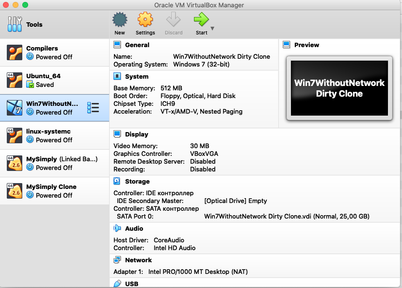

1. In the dialog, specify machine name as "ACOS Ubuntu 20.04 LTS" and click "Continue".

   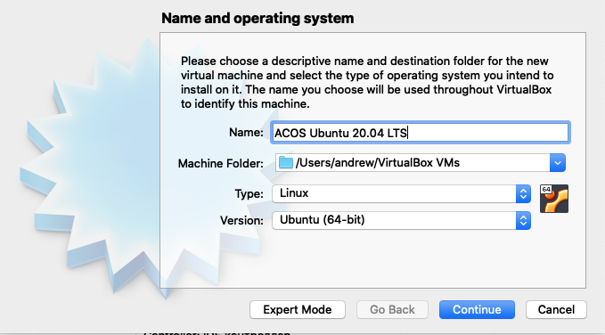

1. Allocate for the new virtual machine 2048 MB of RAM. Click "Continue".

   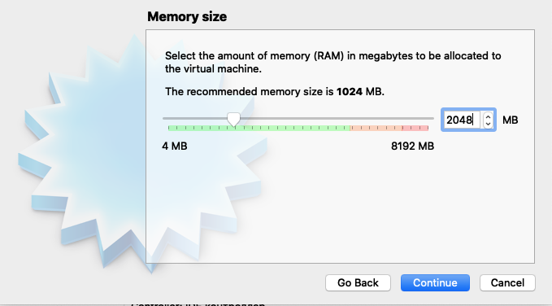

1. Select "Create a virtual hard disk now" and click "Create".

1. Specify hard disk file type as "VDI (VirtualBox Disk Image)" and click "Continue".

1. Specify storage on physical hard disk as "Dynamically allocated" and click "Continue".

1. Specify file location and size for the virtual disk and press "Continue". Location is default. Recommended size is 16 GB.

   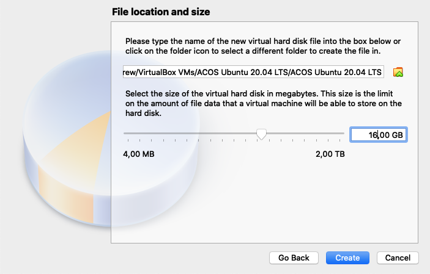

1. Now the virtual machine is created. The next step is to install Linux Ubuntu in it.

1. Select the "ACOS Ubuntu 20.04 LTS" virtual machine and click "Start" in the toolbar.

   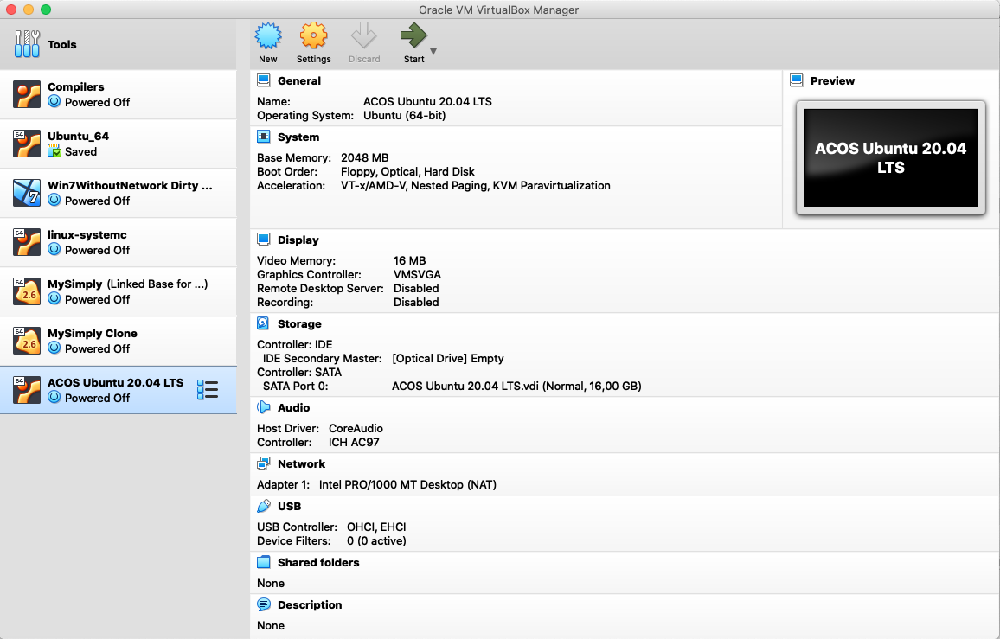

1. In the dialog that appears, select the downloaded `.iso` image with Linux Ubuntu distribution
   (e.g. `ubuntu-20.04.1-desktop-amd64.iso`) to start the virtual machine from. Click "Start".

   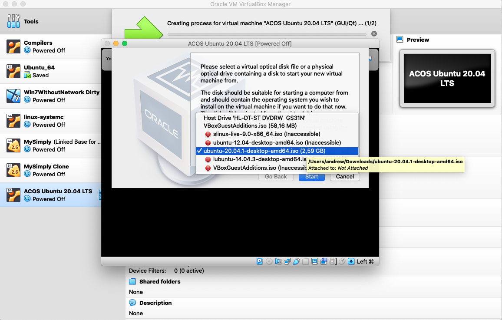

1. VirtualBox will run the virtual machine, which will start loading the Linux Ubuntu distribution from the `.iso` file.

1. When the Ubuntu installer is loaded, click "Install Ubuntu".

   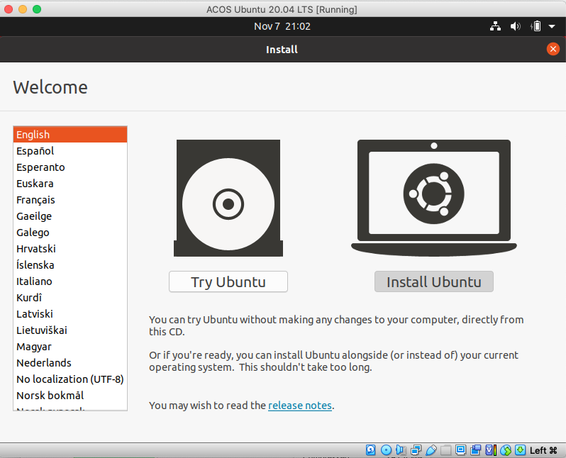

1. Select "English (US)" for the keyboard layout and click "Continue".

1. Select "Minimal installation" and click "Continue". We do not need a full installation.
   Many tools are useless for us. Later we will install tools that we need.

   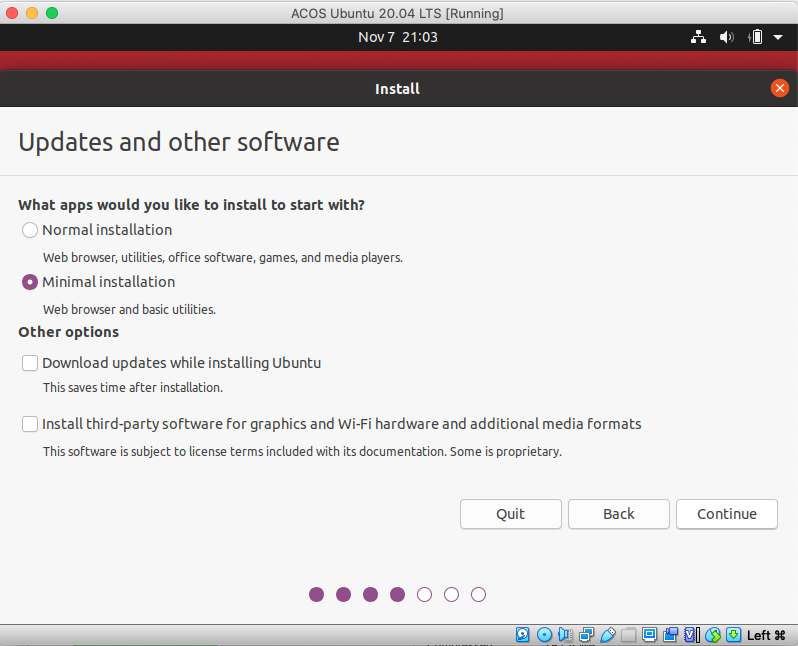

1. Select installation type as "Erase disk and install Ubuntu" and click "Install Now".

   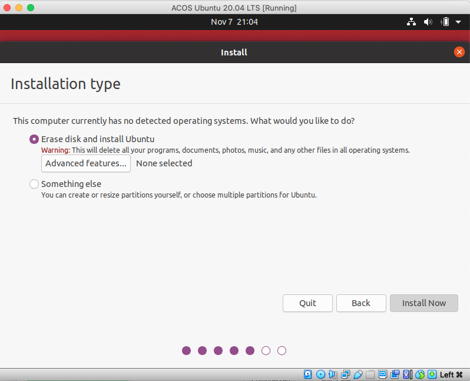

1. In the appearing "Write the changes to disk?" dialog, click "Continue".

1. In the "Where are you?" dialog, specify "Moscow" and click "Continue".

1. Specify your name as "ACOS" (username will be "acos"), computer name as "acos-vm",
   and password as "acos2020" (or as you wish). Click "Continue".

   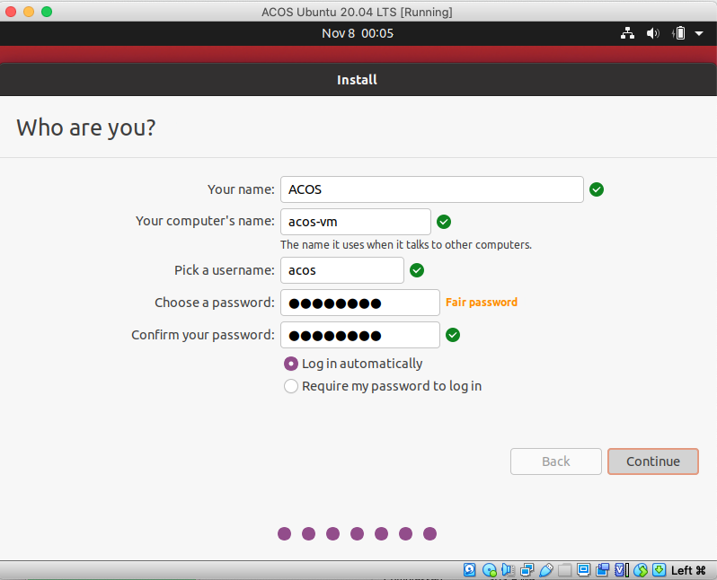

1. Wait for Ubuntu to be installed. This will take about 1 hour.

   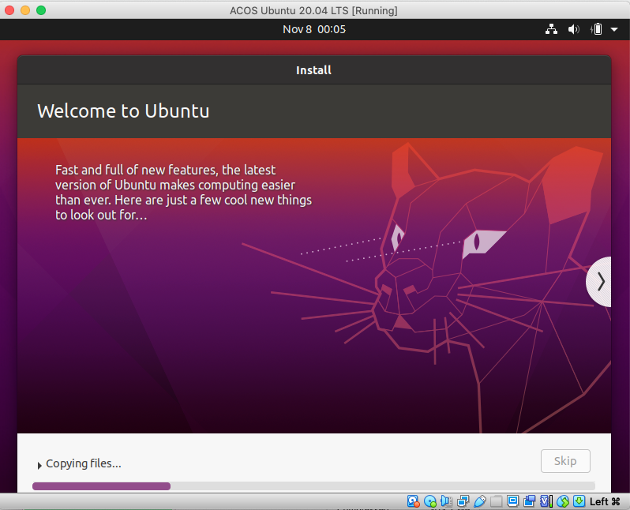

1. When installation is finished, restart the virtual machine.

   

1. Virtual machine "ACOS Ubuntu 20.04 LTS" will start.

   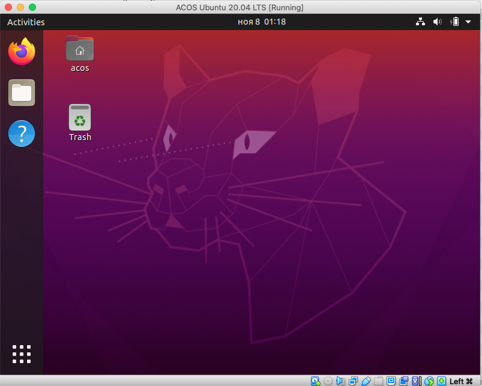

1. Network must work in the virtual machine.

   

# SSH and port forwarding

After Linux Ubuntu is installed in VirtualBox, we need to make sure that the network interface is enabled
and set up port forwarding. We need to det up forwarding for port 22 in order to be able to connect
to the Ubuntu Linux VM from our host operating system using [SSH](https://en.wikipedia.org/wiki/SSH_%28Secure_Shell%29).

#### Configuring the virtual machine in VirtualBox:

1. Select the "ACOS Ubuntu 20.04 LTS" virtual machine and click "Settings" in the toolbar.
1. In the dialog, switch to the "Network" page and click "Port Forwarding".

   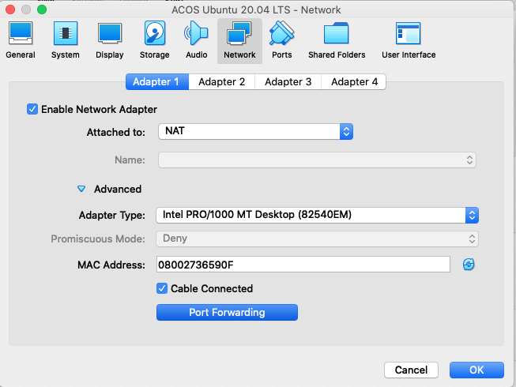

1. Set up a rule for port forwarding. `127.0.0.1` is the local host IP address, 2022 is the port used for forwarding,
   `10.0.2.15` is the IP address for the guest OS (Linux Ubuntu), 22 is the SSH port in Linux Ubuntu.  

   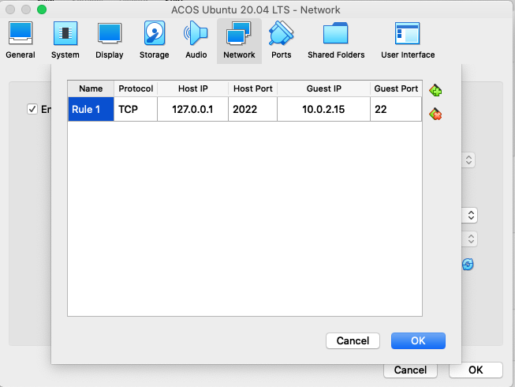

1. Click "OK" to apply the settings.

1. Start the Ubuntu VM.

#### Set up SSH in Linux Ubuntu

1. Open "Terminal" (Ctrl+Alt+T) and execute the following command to install and run the SSH server:

       acos@acos-vm:~$ sudo apt install openssh-server

#### Connecting to Ubuntu via SSH

After SSH server is installed, you can connect to from terminal of your host operating system using the following
command:

    ssh acos@localhost -p2022

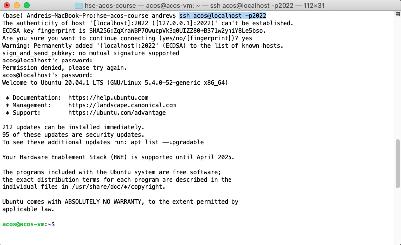

To disconnect, you can type the `exit` command.

# Git

[Git](https://en.wikipedia.org/wiki/Git) is a version-control system that we well
use to get and put source code to GitHub.

To install it, open Terminal (Ctrl+Alt+T) in Ubuntu or connect via SSH and execute the following command:

    acos@acos-vm:~$ sudo apt install git
