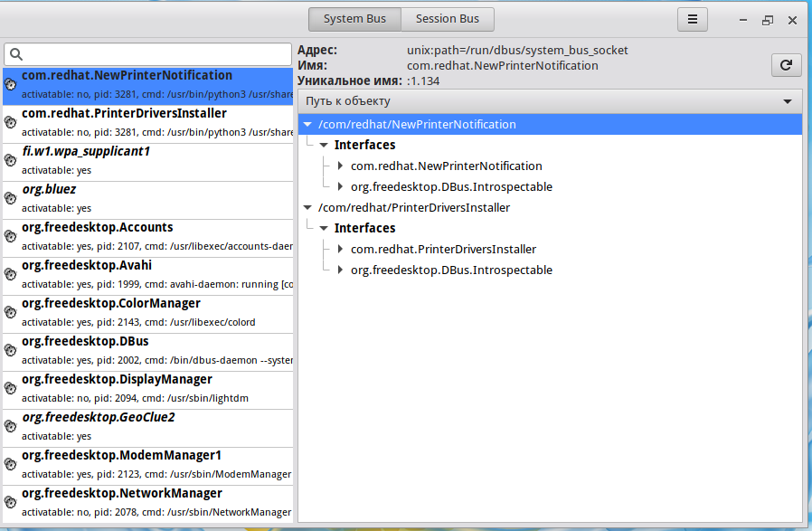
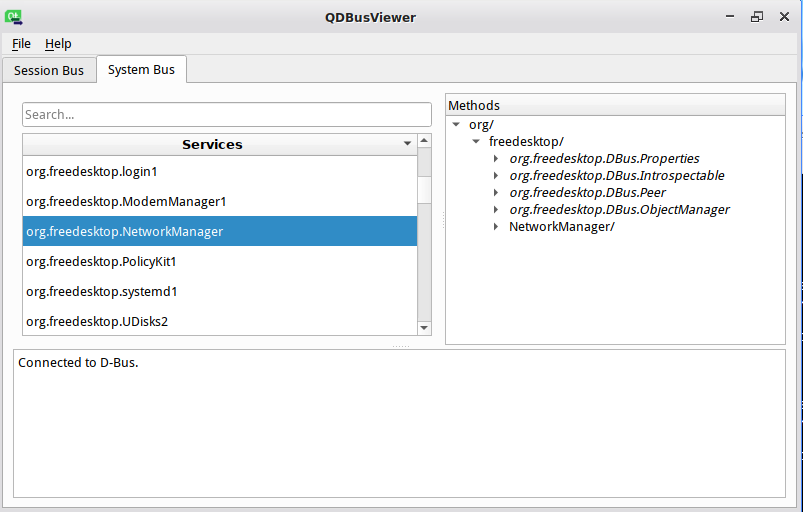

Application Bus
---

1. Some theory:
  
   * https://en.wikipedia.org/wiki/D-Bus
   * https://www.freedesktop.org/wiki/Software/dbus/

2. Install the 'd-feet' package (D-Bus debugger).

       comp-core-i7-3615qm-0dbf32 ~ # apt-get install d-feet

3. Run 'd-feet' to see the installed services:

       andrewt@comp-core-i7-3615qm-0dbf32 ~ $ d-fee

    

4. See list of dbus command-line tools:

       andrewt@comp-core-i7-3615qm-0dbf32 ~ $ dbus-
       dbus-cleanup-sockets   dbus-launch    dbus-run-session   dbus-update-activation-environment  
       dbus-daemon            dbus-monitor   dbus-send          dbus-uuidgen   

5. Use the 'dbus-send' tool to introspect the properties of NetworkManager:

       andrewt@comp-core-i7-3615qm-0dbf32 ~ $ dbus-send --system --print-reply --dest=org.freedesktop.NetworkManager /org/freedesktop/NetworkManager/Devices/1 org.freedesktop.DBus.Introspectable.Introspect
       method return time=1590384778.681292 sender=:1.6 -> destination=:1.141 serial=3362 reply_serial=2
          string "<!DOCTYPE node PUBLIC "-//freedesktop//DTD D-BUS Object Introspection 1.0//EN"
                             "http://www.freedesktop.org/standards/dbus/1.0/introspect.dtd">
       <!-- GDBus 2.60.7 -->
       <node>
         <interface name="org.freedesktop.DBus.Properties">
           <method name="Get">
             <arg type="s" name="interface_name" direction="in"/>
             <arg type="s" name="property_name" direction="in"/>
             <arg type="v" name="value" direction="out"/>
           </method>
           <method name="GetAll">
             <arg type="s" name="interface_name" direction="in"/>
             <arg type="a{sv}" name="properties" direction="out"/>
           </method>
           <method name="Set">
             <arg type="s" name="interface_name" direction="in"/>
             <arg type="s" name="property_name" direction="in"/>
             <arg type="v" name="value" direction="in"/>
           </method>
           <signal name="PropertiesChanged">
             <arg type="s" name="interface_name"/>
             <arg type="a{sv}" name="changed_properties"/>
             <arg type="as" name="invalidated_properties"/>
           </signal>
         </interface>
         <interface name="org.freedesktop.DBus.Introspectable">
           <method name="Introspect">
             <arg type="s" name="xml_data" direction="out"/>
           </method>
         </interface>
         <interface name="org.freedesktop.DBus.Peer">
           <method name="Ping"/>
           <method name="GetMachineId">
             <arg type="s" name="machine_uuid" direction="out"/>
           </method>
         </interface>
         <interface name="org.freedesktop.NetworkManager.Device.Statistics">
           <signal name="PropertiesChanged">
             <arg type="a{sv}" name="properties"/>
           </signal>
           <property type="u" name="RefreshRateMs" access="readwrite"/>
           <property type="t" name="TxBytes" access="read"/>
           <property type="t" name="RxBytes" access="read"/>
         </interface>
         <interface name="org.freedesktop.NetworkManager.Device.Generic">
           <signal name="PropertiesChanged">
             <arg type="a{sv}" name="properties"/>
           </signal>
           <property type="s" name="HwAddress" access="read"/>
           <property type="s" name="TypeDescription" access="read"/>
         </interface>
         <interface name="org.freedesktop.NetworkManager.Device">
           <method name="Reapply">
             <arg type="a{sa{sv}}" name="connection" direction="in"/>
             <arg type="t" name="version_id" direction="in"/>
             <arg type="u" name="flags" direction="in"/>
           </method>
           <method name="GetAppliedConnection">
             <arg type="u" name="flags" direction="in"/>
             <arg type="a{sa{sv}}" name="connection" direction="out"/>
             <arg type="t" name="version_id" direction="out"/>
           </method>
           <method name="Disconnect"/>
           <method name="Delete"/>
           <signal name="StateChanged">
             <arg type="u" name="new_state"/>
             <arg type="u" name="old_state"/>
             <arg type="u" name="reason"/>
           </signal>
           <property type="s" name="Udi" access="read"/>
           <property type="s" name="Interface" access="read"/>
           <property type="s" name="IpInterface" access="read"/>
           <property type="s" name="Driver" access="read"/>
           <property type="s" name="DriverVersion" access="read"/>
           <property type="s" name="FirmwareVersion" access="read"/>
           <property type="u" name="Capabilities" access="read"/>
           <property type="u" name="Ip4Address" access="read"/>
           <property type="u" name="State" access="read"/>
           <property type="(uu)" name="StateReason" access="read"/>
           <property type="o" name="ActiveConnection" access="read"/>
           <property type="o" name="Ip4Config" access="read"/>
           <property type="o" name="Dhcp4Config" access="read"/>
           <property type="o" name="Ip6Config" access="read"/>
           <property type="o" name="Dhcp6Config" access="read"/>
           <property type="b" name="Managed" access="readwrite"/>
           <property type="b" name="Autoconnect" access="readwrite"/>
           <property type="b" name="FirmwareMissing" access="read"/>
           <property type="b" name="NmPluginMissing" access="read"/>
           <property type="u" name="DeviceType" access="read"/>
           <property type="ao" name="AvailableConnections" access="read"/>
           <property type="s" name="PhysicalPortId" access="read"/>
           <property type="u" name="Mtu" access="read"/>
           <property type="u" name="Metered" access="read"/>
           <property type="aa{sv}" name="LldpNeighbors" access="read"/>
           <property type="b" name="Real" access="read"/>
           <property type="u" name="Ip4Connectivity" access="read"/>
           <property type="u" name="Ip6Connectivity" access="read"/>
         </interface>
       </node>
       "

6. More convenient facilities to manage D-Bus are provided by
   the ['qdbus'](https://packages.debian.org/ru/sid/qdbus) tool. Please install it:

       comp-core-i7-3615qm-0dbf32 ~ # sudo apt-get install qt5-dbus
   
   Run QDBusViewer:

       andrewt@comp-core-i7-3615qm-0dbf32 ~ $ qdbusviewer

   

7.  See how to use command-line tool 'qdbus':

        andrewt@comp-core-i7-3615qm-0dbf32 ~ $ qdbus --help
        Usage: qdbus [--system] [--bus busaddress] [--literal] [servicename] [path] [method] [args]
 
         servicename       the service to connect to (e.g., org.freedesktop.DBus)
         path              the path to the object (e.g., /)
         method            the method to call, with or without the interface
         args              arguments to pass to the call
        With 0 arguments, qdbus will list the services available on the bus
        With just the servicename, qdbus will list the object paths available on the service
        With service name and object path, qdbus will list the methods, signals and properties available on the object

        Options:
         --system          connect to the system bus
         --bus busaddress  connect to a custom bus
         --literal         print replies literally

    See all system services registered in D-Bus:

        andrewt@comp-core-i7-3615qm-0dbf32 ~ $ qdbus --system
        :1.0
         org.freedesktop.systemd1
        :1.10
         org.freedesktop.Accounts
        :1.113
        :1.116
         com.redhat.NewPrinterNotification
         com.redhat.PrinterDriversInstaller
        :1.12
        :1.14
         org.freedesktop.ModemManager1
        :1.15
         org.freedesktop.ColorManager
        :1.154
        :1.3
         org.freedesktop.Avahi
        :1.35
        :1.4
         org.freedesktop.login1
        :1.41
        :1.47
        :1.49
        :1.5
         org.freedesktop.PolicyKit1
        :1.50
        :1.52
        :1.53
         org.freedesktop.UPower
        :1.54
        :1.6
         org.freedesktop.NetworkManager
        :1.67
        :1.68
         org.freedesktop.UDisks2
        :1.80
        :1.9
         org.freedesktop.DisplayManager
        :1.93
        :1.94
        org.freedesktop.DBus

    See all objects provided by a specific service:

        andrewt@comp-core-i7-3615qm-0dbf32 ~ $ qdbus --system org.freedesktop.NetworkManager
        /
        /org
        /org/freedesktop
        /org/freedesktop/NetworkManager
        /org/freedesktop/NetworkManager/IP4Config
        /org/freedesktop/NetworkManager/IP4Config/5
        /org/freedesktop/NetworkManager/IP4Config/3
        /org/freedesktop/NetworkManager/IP4Config/4
        /org/freedesktop/NetworkManager/ActiveConnection
        /org/freedesktop/NetworkManager/ActiveConnection/1
        /org/freedesktop/NetworkManager/ActiveConnection/6
        /org/freedesktop/NetworkManager/AgentManager
        /org/freedesktop/NetworkManager/Devices
        /org/freedesktop/NetworkManager/Devices/2
        /org/freedesktop/NetworkManager/Devices/3
        /org/freedesktop/NetworkManager/Devices/1
        /org/freedesktop/NetworkManager/DHCP4Config
        /org/freedesktop/NetworkManager/DHCP4Config/6
        /org/freedesktop/NetworkManager/DnsManager
        /org/freedesktop/NetworkManager/IP6Config
        /org/freedesktop/NetworkManager/IP6Config/9
        /org/freedesktop/NetworkManager/IP6Config/3
        /org/freedesktop/NetworkManager/IP6Config/4
        /org/freedesktop/NetworkManager/Settings
        /org/freedesktop/NetworkManager/Settings/2
        /org/freedesktop/NetworkManager/Settings/3
        /org/freedesktop/NetworkManager/Settings/1

    See methods and properties provided by a specific object:

        andrewt@comp-core-i7-3615qm-0dbf32 ~ $ qdbus --system org.freedesktop.NetworkManager /org/freedesktop/NetworkManager/Devices/1
        signal void org.freedesktop.DBus.Properties.PropertiesChanged(QString interface_name, QVariantMap changed_properties, QStringList invalidated_properties)
        method QDBusVariant org.freedesktop.DBus.Properties.Get(QString interface_name, QString property_name)
        method QVariantMap org.freedesktop.DBus.Properties.GetAll(QString interface_name)
        method void org.freedesktop.DBus.Properties.Set(QString interface_name, QString property_name, QDBusVariant value)
        method QString org.freedesktop.DBus.Introspectable.Introspect()
        method QString org.freedesktop.DBus.Peer.GetMachineId()
        method void org.freedesktop.DBus.Peer.Ping()
        property readwrite uint org.freedesktop.NetworkManager.Device.Statistics.RefreshRateMs
        property read qulonglong org.freedesktop.NetworkManager.Device.Statistics.RxBytes
        property read qulonglong org.freedesktop.NetworkManager.Device.Statistics.TxBytes
        signal void org.freedesktop.NetworkManager.Device.Statistics.PropertiesChanged(QVariantMap properties)
        property read QString org.freedesktop.NetworkManager.Device.Generic.HwAddress
        property read QString org.freedesktop.NetworkManager.Device.Generic.TypeDescription
        signal void org.freedesktop.NetworkManager.Device.Generic.PropertiesChanged(QVariantMap properties)
        property read QDBusObjectPath org.freedesktop.NetworkManager.Device.ActiveConnection
        property readwrite bool org.freedesktop.NetworkManager.Device.Autoconnect
        property read QList<QDBusObjectPath> org.freedesktop.NetworkManager.Device.AvailableConnections
        property read uint org.freedesktop.NetworkManager.Device.Capabilities
        property read uint org.freedesktop.NetworkManager.Device.DeviceType
        property read QDBusObjectPath org.freedesktop.NetworkManager.Device.Dhcp4Config
        property read QDBusObjectPath org.freedesktop.NetworkManager.Device.Dhcp6Config
        property read QString org.freedesktop.NetworkManager.Device.Driver
        property read QString org.freedesktop.NetworkManager.Device.DriverVersion
        property read bool org.freedesktop.NetworkManager.Device.FirmwareMissing
        property read QString org.freedesktop.NetworkManager.Device.FirmwareVersion
        property read QString org.freedesktop.NetworkManager.Device.Interface
        property read uint org.freedesktop.NetworkManager.Device.Ip4Address
        property read QDBusObjectPath org.freedesktop.NetworkManager.Device.Ip4Config
        property read uint org.freedesktop.NetworkManager.Device.Ip4Connectivity
        property read QDBusObjectPath org.freedesktop.NetworkManager.Device.Ip6Config
        property read uint org.freedesktop.NetworkManager.Device.Ip6Connectivity
        property read QString org.freedesktop.NetworkManager.Device.IpInterface
        property read {D-Bus type "aa{sv}"} org.freedesktop.NetworkManager.Device.LldpNeighbors
        property readwrite bool org.freedesktop.NetworkManager.Device.Managed
        property read uint org.freedesktop.NetworkManager.Device.Metered
        property read uint org.freedesktop.NetworkManager.Device.Mtu
        property read bool org.freedesktop.NetworkManager.Device.NmPluginMissing
        property read QString org.freedesktop.NetworkManager.Device.PhysicalPortId
        property read bool org.freedesktop.NetworkManager.Device.Real
        property read uint org.freedesktop.NetworkManager.Device.State
        property read {D-Bus type "(uu)"} org.freedesktop.NetworkManager.Device.StateReason
        property read QString org.freedesktop.NetworkManager.Device.Udi
        signal void org.freedesktop.NetworkManager.Device.StateChanged(uint new_state, uint old_state, uint reason)
        method void org.freedesktop.NetworkManager.Device.Delete()
        method void org.freedesktop.NetworkManager.Device.Disconnect()
        method {D-Bus type "a{sa{sv}}"} org.freedesktop.NetworkManager.Device.GetAppliedConnection(uint flags, qulonglong& version_id)
        method void org.freedesktop.NetworkManager.Device.Reapply({D-Bus type "a{sa{sv}}"} connection, qulonglong version_id, uint flags)

    Use qdbus to request information on network interfaces:

        andrewt@comp-core-i7-3615qm-0dbf32 ~ $ qdbus --system org.freedesktop.NetworkManager /org/freedesktop/NetworkManager/Devices/1 org.freedesktop.NetworkManager.Device.Interface
        lo
        andrewt@comp-core-i7-3615qm-0dbf32 ~ $ qdbus --system org.freedesktop.NetworkManager /org/freedesktop/NetworkManager/Devices/2 org.freedesktop.NetworkManager.Device.Interface
        eth0
        andrewt@comp-core-i7-3615qm-0dbf32 ~ $ qdbus --system org.freedesktop.NetworkManager /org/freedesktop/NetworkManager/Devices/3 org.freedesktop.NetworkManager.Device.Interface
        eth1

    In the same way, it is possible to manage network interfaces via other properties and methods.
 
 8. It is possibly to manage D-Bug from programs in high-level programming languages.
    For example, a library called [pydbus](https://github.com/LEW21/pydbus) allows
    doing it from Python.
    
    Install the 'pip' package manager:
    
        comp-core-i7-3615qm-0dbf32 ~ # apt-get install python3-module-pip

    Install the 'pydbus' library:
    
        comp-core-i7-3615qm-0dbf32 ~ # pip3 install pydbus
