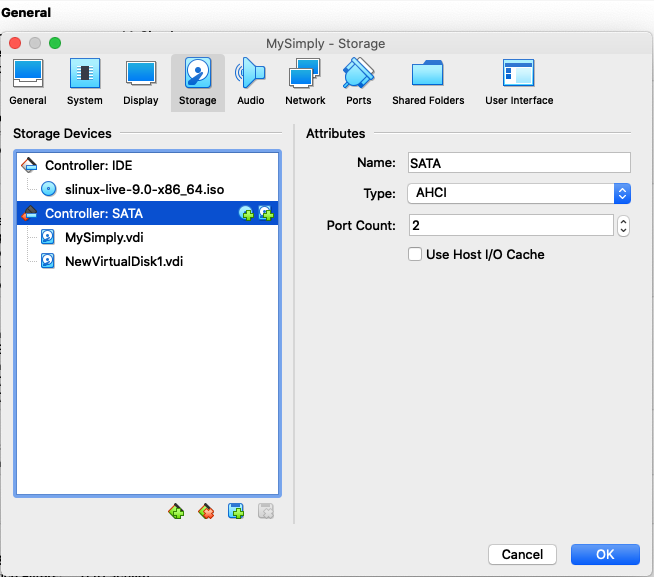
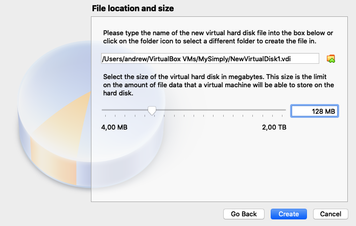
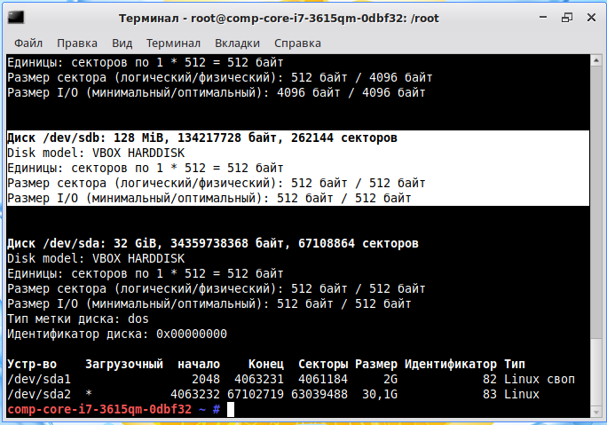
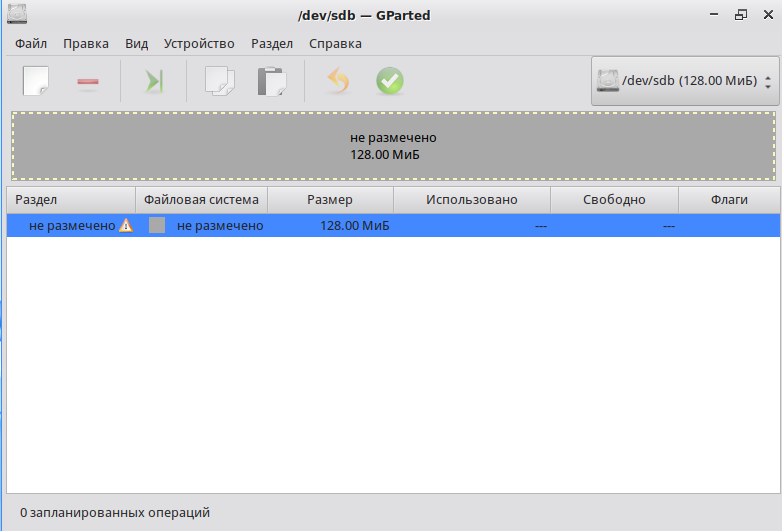
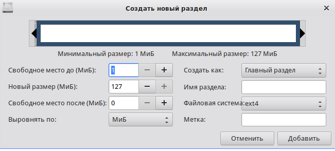

Services
---

For some theory, see [Managing Services with systemd](
https://access.redhat.com/documentation/en-us/red_hat_enterprise_linux/7/html/system_administrators_guide/chap-managing_services_with_systemd)
by RedHat.

## Mounting a disk with systemd

1. Create a new Virtual Disk in VirtualBox.

2. Boot the Virtual Machine.

3. See the created disk.
 
       andrewt@comp-core-i7-3615qm-0dbf32 ~ $ su -
       comp-core-i7-3615qm-0dbf32 ~ # fdisk -l

4. Run GParted to create partitions.

       comp-core-i7-3615qm-0dbf32 ~ # gparted /dev/sdb

5. Run fdisk to see the created partition.

       comp-core-i7-3615qm-0dbf32 ~ # fdisk -l

   Output:

       Device     Start    End Sectors  Size Type
       /dev/sdb1   2048 260095  258048  126M Linux filesystem

6. See information on currently mounted partitions.

        andrewt@comp-core-i7-3615qm-0dbf32 ~ $ df
        Filesystem      Size  Used Avail Use% Mounted on
        udevfs          985M     0  985M   0% /dev
        runfs           993M  1.1M  992M   1% /run
        /dev/sda2        30G  7.9G   21G  28% /
        tmpfs           993M  4.0K  993M   1% /dev/shm
        tmpfs           5.0M     0  5.0M   0% /run/lock
        tmpfs           993M     0  993M   0% /sys/fs/cgroup
        tmpfs           993M  8.0K  993M   1% /tmp
        tmpfs           199M  8.0K  199M   1% /run/user/500

7. See manual page on mount unit configuration.

       andrewt@comp-core-i7-3615qm-0dbf32 ~ $ man systemd.mount

8. See locations of systemd units. 

   Non-modifiable units:

       andrewt@comp-core-i7-3615qm-0dbf32 ~ $ ls /lib/systemd/system -l

   Configurable units: 

       andrewt@comp-core-i7-3615qm-0dbf32 ~ $ ls /etc/systemd/system -l

9. See IDs of disk devices:

       andrewt@comp-core-i7-3615qm-0dbf32 ~ $ su -
       Password: 

       comp-core-i7-3615qm-0dbf32 ~ # blkid
       /dev/sda1: UUID="8adb69dd-b152-45b6-b4b0-4824f2282d2c" TYPE="swap"
       /dev/sda2: UUID="a4ba36d4-a42e-48a6-ae91-7e2acbd71ce8" TYPE="ext4"
       /dev/sr0: UUID="2020-04-02-21-43-51-00" LABEL="Simply Linux live 9.0 x86_64" TYPE="iso9660" PTUUID="333d32d7" PTTYPE="dos"
       /dev/pktcdvd/pktcdvd0: UUID="2020-04-02-21-43-51-00" LABEL="Simply Linux live 9.0 x86_64" TYPE="iso9660" PTUUID="333d32d7" PTTYPE="dos"
       /dev/sdb1: UUID="be221b17-728f-4636-9a6c-6cc2c2f97b4e" TYPE="ext4" PARTUUID="ab228d6f-ead7-4d5d-b436-1cd539d7f79b"

       comp-core-i7-3615qm-0dbf32 ~ # ls /dev/disk/by-uuid/
       2020-04-02-21-43-51-00                a4ba36d4-a42e-48a6-ae91-7e2acbd71ce8
       8adb69dd-b152-45b6-b4b0-4824f2282d2c  be221b17-728f-4636-9a6c-6cc2c2f97b4e

       comp-core-i7-3615qm-0dbf32 ~ # ls /dev/disk/by-id/ -l
       total 0
       lrwxrwxrwx 1 root root  9 May 12 19:10 ata-VBOX_CD-ROM_VB2-01700376 -> ../../sr0
       lrwxrwxrwx 1 root root  9 May 12 23:30 ata-VBOX_HARDDISK_VB95f922ef-001cd0ee -> ../../sdb
       lrwxrwxrwx 1 root root 10 May 12 23:30 ata-VBOX_HARDDISK_VB95f922ef-001cd0ee-part1 -> ../../sdb1
       lrwxrwxrwx 1 root root  9 May 12 22:21 ata-VBOX_HARDDISK_VBe293c3d6-9409ce04 -> ../../sda
       lrwxrwxrwx 1 root root 10 May 12 22:21 ata-VBOX_HARDDISK_VBe293c3d6-9409ce04-part1 -> ../../sda1
       lrwxrwxrwx 1 root root 10 May 12 22:21 ata-VBOX_HARDDISK_VBe293c3d6-9409ce04-part2 -> ../../sda2

10. Create new mount unit.

        andrewt@comp-core-i7-3615qm-0dbf32 ~ $ mcedit /etc/systemd/system/srv.mount
       
    Mount unit configuration:

        [Unit]
        Description=Additional drive
   
        [Mount]
        What=/dev/disk/by-id/ata-VBOX_HARDDISK_VB95f922ef-001cd0ee-part1
        Where=/srv
        Type=ext4
        Options=defaults

        [Install]
        WantedBy=multi-user.target

11. Verify the created unit:

        comp-core-i7-3615qm-0dbf32 ~ # systemd-analyze verify srv.mount
        /lib/systemd/system/alteratord.socket:6: ListenStream= references a path below legacy directory /var/run/, updating /var/run/alteratord/.socket → /run/alteratord/.socket; please update the unit file accordingly.
        /lib/systemd/system/smb.service:10: PIDFile= references a path below legacy directory /var/run/, updating /var/run/smbd.pid → /run/smbd.pid; please update the unit file accordingly.
        /lib/systemd/system/winbind.service:9: PIDFile= references a path below legacy directory /var/run/, updating /var/run/winbindd.pid → /run/winbindd.pid; please update the unit file accordingly.
        /lib/systemd/system/nmb.service:10: PIDFile= references a path below legacy directory /var/run/, updating /var/run/nmbd.pid → /run/nmbd.pid; please update the unit file accordingly.
        /lib/systemd/system/chronyd.service:10: PIDFile= references a path below legacy directory /var/run/, updating /var/run/chrony/chronyd.pid → /run/chrony/chronyd.pid; please update the unit file accordingly.
    
12. Check the service status.

        comp-core-i7-3615qm-0dbf32 ~ # systemctl status srv.mount 
        ● srv.mount - Additional drive
           Loaded: loaded (/etc/systemd/system/srv.mount; disabled; vendor preset: disabled)
           Active: inactive (dead)
            Where: /srv
             What: /dev/disk/by-id/ata-VBOX_HARDDISK_VB95f922ef-001cd0ee-part1

13. Start the service and check it status again.

        comp-core-i7-3615qm-0dbf32 ~ # systemctl start srv.mount 
        comp-core-i7-3615qm-0dbf32 ~ # systemctl status srv.mount 
        ● srv.mount - Additional drive
           Loaded: loaded (/etc/systemd/system/srv.mount; disabled; vendor preset: disabled)
           Active: active (mounted) since Wed 2020-05-13 00:21:09 MSK; 1s ago
            Where: /srv
             What: /dev/sdb1
            Tasks: 0 (limit: 2361)
           Memory: 84.0K
           CGroup: /system.slice/srv.mount
        
        May 13 00:21:09 comp-core-i7-3615qm-0dbf32 systemd[1]: Mounting Additional drive...
        May 13 00:21:09 comp-core-i7-3615qm-0dbf32 systemd[1]: Mounted Additional drive.
        comp-core-i7-3615qm-0dbf32 ~ # 

14. See the newly mounted disk.

        comp-core-i7-3615qm-0dbf32 ~ # df
        Filesystem      Size  Used Avail Use% Mounted on
        udevfs          985M     0  985M   0% /dev
        runfs           993M  1.1M  992M   1% /run
        /dev/sda2        30G  7.9G   21G  28% /
        tmpfs           993M  4.0K  993M   1% /dev/shm
        tmpfs           5.0M     0  5.0M   0% /run/lock
        tmpfs           993M     0  993M   0% /sys/fs/cgroup
        tmpfs           993M  8.0K  993M   1% /tmp
        tmpfs           199M  8.0K  199M   1% /run/user/500
        /dev/sdb1       119M  1.6M  108M   2% /srv

15. Enable the service.

        comp-core-i7-3615qm-0dbf32 ~ # systemctl enable srv.mount 
        Created symlink /etc/systemd/system/multi-user.target.wants/srv.mount → /etc/systemd/system/srv.mount.
        comp-core-i7-3615qm-0dbf32 ~ #

16. See service dependencies.

        comp-core-i7-3615qm-0dbf32 ~ # systemctl list-dependencies srv.mount 
        srv.mount
        ● ├─-.mount
        ● ├─dev-disk-by\x2did-ata\x2dVBOX_HARDDISK_VB95f922ef\x2d001cd0ee\x2dpart1.device
        ● ├─dev-sdb1.device
        ● └─system.slice
